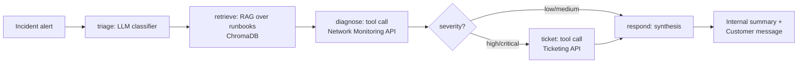

# NetOps Agent

**Agentic incident triage & resolution assistant for telecom network operations.**

A portfolio project built for the *Agentic Software Engineer (m/w/d)* role at **Reply**.
The use case — automated triage of network incidents using live telemetry, a runbook
knowledge base, and an agentic ticketing workflow — mirrors the kind of Delivery Squad
work Reply does for telecom/network operator clients, one of its core historical
verticals (alongside banking/insurance, industry, and public administration).

## What it does

A network alert comes in ("total signal loss on fiber segment, node DOWN..."). The agent:

1. **Triages** the alert — classifies category + severity
2. **Retrieves** the matching runbook section via RAG (ChromaDB vector search)
3. **Diagnoses** by calling a live network-telemetry tool (real API call, not a stub answer)
4. **Routes**: high/critical severity → opens a ticket via a ticketing-system tool;
   lower severity → skips straight to resolution (agentic *decision*, not just text generation)
5. **Responds** with an internal resolution summary and a separate customer-facing message

Every step is traced (latency, tool I/O, errors) and every decision is covered by an
evaluation suite that checks triage accuracy, retrieval relevance, and routing
correctness — independently, the way you'd want to debug a real agent in production.

## Architecture



Built with **LangGraph** as an explicit state machine (not a black-box agent loop) so
each step, tool call, and routing decision is inspectable and independently testable —
important for the kind of client-facing, auditable systems a consultancy delivers.

## Tech stack (and why)

| Layer | Choice | Why |
|---|---|---|
| Agent orchestration | **LangGraph** + LangChain | Explicit graph/state machine over a chat-loop agent — deterministic control flow, conditional routing, easy to reason about and demo to a client |
| LLM | **Anthropic Claude** (configurable, also supports Groq) | Pluggable provider; defaults to a deterministic **mock mode** so the whole project runs and tests pass with zero API keys |
| Retrieval / Vector DB | **ChromaDB** | Real vector database with persisted embeddings + cosine similarity search; embedding function is swappable (TF-IDF by default for offline/CI use, one-line swap to a hosted embedding model) |
| API integrations | **FastAPI** (x3: network monitoring, ticketing, orchestrator) | Typed, async, the de-facto standard for Python microservices; mirrors calling into a client's real NOC/ticketing systems |
| Tests | **pytest** | Unit tests per tool, integration tests for the full graph, API-level tests via `TestClient` |
| Evaluations | Custom eval harness (`evals/run_evals.py`) | Checks triage accuracy, retrieval relevance, and routing correctness independently across 6 scenarios; usable as a CI quality gate |
| Observability | Custom JSONL tracer + Streamlit dashboard | Structured per-node spans and tool-call logs; swappable for LangSmith/OpenTelemetry in production |
| Demo UI | **Gradio** | Consistent with the free-hosting approach (Hugging Face Spaces) used across this portfolio |
| CI/CD | **GitHub Actions** | Runs the full test + eval suite on every push |
| Containerization | **Docker / docker-compose** | Three-service deployment (orchestrator + 2 mock backends) |

## Project layout

```
netops-agent/
├── agent/                  # core agent: graph, tools, RAG, LLM client, tracer
├── services/                # mock backend APIs (network monitoring, ticketing)
├── orchestrator/             # public REST API wrapping the agent graph
├── data/runbooks/            # knowledge base (6 telecom incident runbooks, markdown)
├── scripts/build_kb.py       # ingest runbooks into ChromaDB
├── evals/                    # eval cases + harness + last run's report
├── tests/                    # pytest unit/integration/API tests
├── ui/app.py                 # Gradio demo
├── dashboard/                 # Streamlit observability dashboard
└── .github/workflows/ci.yml   # CI: tests + evals on every push
```

## Running it locally

```bash
python -m venv .venv && .venv\Scripts\activate   # Windows (PowerShell)
pip install -r requirements.txt

python scripts/build_kb.py          # build the vector index (one-time)

# terminal 1
PYTHONPATH=. python -m uvicorn services.network_monitoring_api:app --port 8001
# terminal 2
PYTHONPATH=. python -m uvicorn services.ticketing_api:app --port 8002
# terminal 3
PYTHONPATH=. python -m uvicorn orchestrator.main:app --port 8000

curl -X POST http://localhost:8000/incident -H "Content-Type: application/json" -d '{
  "incident_id": "INC-1",
  "node_id": "node-fiber-cut-berlin-04",
  "region": "Berlin",
  "raw_alert_text": "Total signal loss on fiber segment, node DOWN, customers report full outage."
}'
```

Or use the `Makefile` targets: `make install`, `make build-kb`, `make services`,
`make api`, `make test`, `make evals`, `make ui`, `make dashboard`, `make docker-up`.

Runs entirely offline by default (`LLM_PROVIDER=mock` in `.env.example`) — no API keys
needed to explore the code, run the tests, or run the evals. Set `LLM_PROVIDER=anthropic`
and `ANTHROPIC_API_KEY=...` in a `.env` file to use live Claude reasoning for triage and
response synthesis instead of the rule-based mock.

## Tests & evals

```bash
make test     # 12 pytest cases: tools, graph routing, API contracts
make evals    # 6 end-to-end scenarios, checks triage/retrieval/routing independently
```

Current eval run: **6/6 scenarios passing** (100%) — see `evals/last_eval_report.json`.

## Notes on scope

This is a portfolio project, not a production system — the network monitoring and
ticketing "APIs" are deliberately mocked (seeded/deterministic telemetry) rather than
wired to real infrastructure, so it can be reviewed and run by anyone without
credentials or access to a live network. The interesting parts for this role — the
agent graph design, tool-use pattern, RAG pipeline, evaluation methodology, and
observability approach — are all real and fully functional.
